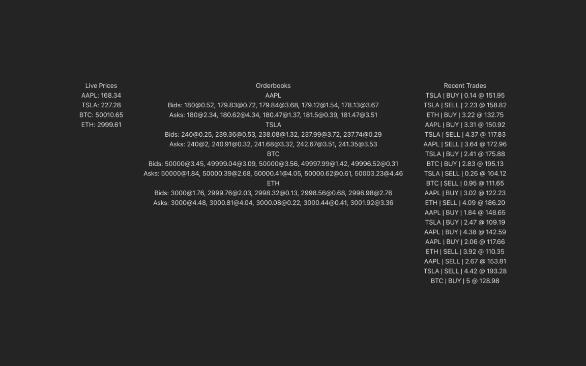

# Real-Time Trading Engine
A high-performance, fullstack event-driven trading simulation platform. This project demonstrates the orchestration of live market data—including prices, orderbooks, and trades—using a modern WebSocket-based architecture.

## 🚀 Overview
This platform is designed to showcase high-frequency data streaming and scalable backend architecture typical of production-grade trading systems. It uses a "Publish-Subscribe" pattern to ensure clients only receive the data they need, minimizing bandwidth and maximizing performance.

## ✨ Features
- Live Price Streaming: Real-time price updates for multiple symbols.
- Dynamic Orderbooks: Visualized Bids and Asks updated via high-frequency events.
- Trade History: A continuous stream of simulated buy/sell executions.
- Event-Driven Backend: Decoupled architecture where internal services emit events and the WebSocket Gateway handles broadcasting.
- Selective Subscriptions: Clients can subscribe to specific topics (e.g., symbol.price, symbol.orderbook, symbol.trades) to optimize data flow.

## 🛠️ Tech Stack
- Backend (NestJS)
- NestJS: A progressive Node.js framework for building efficient, reliable, and scalable server-side applications.
- Socket.IO: Real-time, bidirectional, and event-based communication.
- EventEmitter2: Used for internal decoupling of the price/trade generators from the communication layer.
- Frontend (React)
- React.js (Vite): Fast, modern UI development.
- TypeScript: Type-safe components and state management.
- Tailwind CSS: Responsive and clean trading dashboard UI.

## 🏗️ Architecture
- The system follows a three-tier event flow:
- **Generators:** Internal services simulate market volatility.
- **Event Bus:** Generators emit events locally using @nestjs/event-emitter.
- **Gateway:** The Trading Gateway listens for these local events and broadcasts them to clients connected via Socket.IO.

